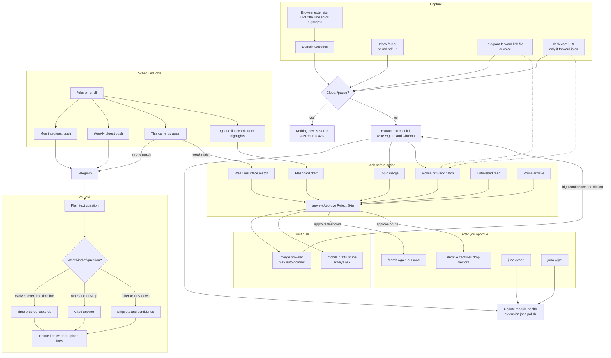

# JUNO user workflow

What you can do with Juno today (**v2.0**, M5 complete), how far each user-facing feature goes, and the full agent loop those features sit in.

Telegram on this PC is the interface. Capture clients (browser and inbox) only talk to loopback `juno serve`. The bot answers only while that process is running.

**Levels**

| Level | Meaning |
| ----- | ------- |
| **Shipped** | Usable end to end as built for v2.0 |
| **Partial** | Works, thinner than the product spec |
| **Not built** | Specified, explicitly left out |

---

## Feature levels

### Ask and control (Telegram)

| Feature | How you use it | Level |
| ------- | -------------- | ----- |
| Natural-language search | Send ordinary text (not a bare link or a forward) | **Shipped** — citations and a confidence score. A sourced paragraph when the local LLM is up; snippet list when it is not |
| “How has this evolved?” | Ask with words like evolved, over time, timeline, how has my | **Partial** — matching captures come back in time order with dates. No written narrative of how your understanding changed |
| Cross-source lines | Automatic on answers that hit browser captures | **Shipped** — “you also uploaded…” from related inbox rows |
| On-demand digest | `/digest today` or `/digest week` | **Shipped** — grouped browser reading vs uploads and other notes |
| Pause / resume | `/pause`, `/resume` | **Shipped** — stops inbox, API ingest, Telegram capture, scheduled pushes, and draft/flashcard generation. Resume drains the inbox backlog |
| Module health | `/status` | **Shipped** — core, extension, ide, jobs, polish heartbeats, LLM/embedder, trust dials, serve-down reminder |
| Job switches | `/jobs` and `/jobs daily\|weekly\|resurface\|polish on\|off` | **Shipped** |
| Review queue | `/review` with Approve / Reject / Skip | **Shipped** for merges, resurfacing, flashcard drafts, unfinished reads, and prune. **Partial** for mobile and Slack: the text is already in the graph when the card appears; Reject does not pull it back out |
| Flashcards | `/cards` (Again / Good) | **Shipped** as spaced repetition after you approve the draft. New cards are not studyable until `/review` Approve |
| Skill gaps | `/gaps` | **Partial** — unfinished reads (low scroll, not revisited). Low-confidence flags go to `/review`. The same gap is not nagged twice |
| Trust dial | `/trust` and `/trust merge\|browser on\|off` | **Shipped** as an explicit per-category switch. Five Approves on merge can turn auto-commit on. `mobile`, `drafts`, and `prune` stay gated and cannot be turned on |
| Selective prune | `/prune` then `/prune confirm`, then Approve in `/review` | **Shipped** — archives old unused captures and drops their vectors. Reject leaves them. This is not `juno wipe` |
| Who may talk to the bot | `ALLOWED_TELEGRAM_USER_IDS` | **Shipped** — empty list rejects everyone |

### Capture

| Feature | How it enters | Level |
| ------- | ------------- | ----- |
| Inbox drop | `.txt` / `.md` / `.pdf` / `.url` in `inbox/` | **Shipped** — good files move to `inbox/.processed/`, bad PDFs to `inbox/.failed/` |
| Browser visit | MV3 extension → `POST /ingest` | **Shipped** — URL, title, timestamp, active time, scroll depth. Domain excludes in extension options. Pause returns HTTP 423 and the extension backs off |
| Highlights | Select text on the page | **Shipped** — stored on the visit and included in the searchable text. These feed flashcards |
| Cursor chats, terminal errors, “have I seen this error?” | — | **Removed** — Juno does not watch the IDE or act as a coding helper |
| Referring search query | — | **Not built** |
| Tab clustering, bookmarks, rabbit-hole path (A→B→C), “don’t reopen, you already finished this” | — | **Not built** |
| Forward, note, or link | Telegram forward, or a message that is only an http(s) URL | **Shipped** — links ingest immediately. Forwards and plain notes are captured and also queued as a mobile review card (see Review queue) |
| Document | Telegram file | **Shipped** — same mobile-review caveat |
| Voice memo | Telegram voice note | **Partial** — opt-in speech-to-text, then ingest as a note plus a mobile review card. The transcript is not answered as a question |
| Photo | — | **Not built** |
| Slack | Send a slack.com URL while `JUNO_SLACK_FORWARD=true` | **Partial** — one opted-in link into the upload space, plus a review card. Not a workspace bot or a passive listener |
| Phone offline queue | — | **Not built** as an on-device queue. Telegram may hold updates about 24 hours while the PC is off; longer downtime can drop them |
| Study apps / Kindle / selected chat export | — | **Not built** |
| Save / “what do I know” / remind-me buttons, multi-turn chat memory | — | **Not built**. Each question is answered from the graph, not from earlier turns in the chat |

### What the agent does without you asking

| Feature | What you see | Level |
| ------- | ------------ | ----- |
| Morning digest | Scheduled Telegram push (same grouping as `/digest today`) | **Shipped** — skipped while paused; `/jobs daily off` disables it |
| Weekly digest | Scheduled push | **Shipped** |
| “This came up again” | Push when a new capture matches something older | **Shipped** for a high-confidence match. A weaker match waits in `/review` instead of being pushed |
| Polish tick | No push | **Shipped** — queues highlight flashcards for `/review`. Skipped while paused |
| Topic merge | Usually invisible until `/review` | **Partial** — proposed graph links wait for Approve unless the merge trust dial auto-commits a high-confidence one. There is no rich “one node per concept” browser |
| Learning your edits | Trust counters on Approve | **Partial** — success counts can loosen merge only. Draft wording does not learn your voice |

### On the machine (not Telegram)

| Feature | Command | Level |
| ------- | ------- | ----- |
| Export | `juno export` | **Shipped** |
| Wipe everything | `juno wipe --confirm wipe-all-data` (stop serve first on Windows) | **Shipped** — nuclear, separate from prune |
| Keep the bot up | Startup shortcut to `juno serve` | **Partial** — comes back after login. Sleep, shutdown, or a crash still means no replies |

---

## Agentic loop

One process. Capture, review, search, and scheduled jobs share it. Dotted lines are partial: the step runs, but it does not fully match the product spec (see the tables).

### How a turn moves

1. **Capture.** The extension, inbox watcher, or Telegram drops text into ingest. Excludes and `/pause` refuse the write. A normal browser visit is stored immediately.
2. **Index.** Text is chunked, written through the SQLite queue, and embedded into Chroma in the same serve process. Module health records that the source is alive.
3. **Ask.** Sensitive Telegram/Slack batches, topic merges, weak resurfacing, flashcard drafts, unfinished reads, and prune sit in `/review`. Approve on a flashcard makes it studyable. Approve on prune archives. Trust dials can skip the queue only for merge and browser.
4. **Answer.** A question is retrieval over reading, uploads, and notes. Time-shaped questions sort hits. Other questions get a cited LLM answer when Ollama (or the configured model) is healthy, otherwise snippets. Related uploads are appended when a browser hit supports them.
5. **Push.** Cron on the same loop sends digests and strong resurfacing notes, and queues polish drafts. `/pause` and `/jobs … off` stop those ticks.
6. **Study and cleanup.** Approved flashcards are reviewed in `/cards`. Export and wipe stay CLI-only. Wipe is the only full delete.

---

## Not in this loop

Left out on purpose:

- Cursor watching, terminal-error capture, and “have I seen this error?”
- Dev journal / README drafts from IDE sessions
- Live Slack workspace listener
- Unattended writes into your git repos
- Rabbit-hole session narrative
- Referring search query, tab clustering, bookmarks
- Voice question → spoken or text answer (voice is capture only)
- Multi-turn memory inside the Telegram chat
- On-device offline queue for the phone
- Photo ingest, study-app or Kindle import, selective chat export
